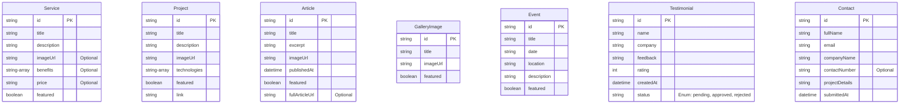

# Entity-Relationship Diagram

This diagram visualizes the database schema for the AI Solutions Hub application.

```mermaid
erDiagram
    Service {
        string id PK
        string title
        string description
        string imageUrl "Optional"
        string-array benefits "Optional"
        string price "Optional"
        boolean featured
    }

    Project {
        string id PK
        string title
        string description
        string imageUrl
        string-array technologies
        boolean featured
        string link
    }

    Article {
        string id PK
        string title
        string excerpt
        string imageUrl
        datetime publishedAt
        boolean featured
        string fullArticleUrl "Optional"
    }

    GalleryImage {
        string id PK
        string title
        string imageUrl
        boolean featured
    }

    Event {
        string id PK
        string title
        string date
        string location
        string description
        boolean featured
    }

    Testimonial {
        string id PK
        string name
        string company
        string feedback
        int rating
        datetime createdAt
        string status "Enum: pending, approved, rejected"
    }

    Contact {
        string id PK
        string fullName
        string email
        string companyName
        string contactNumber "Optional"
        string projectDetails
        datetime submittedAt
    }
```
